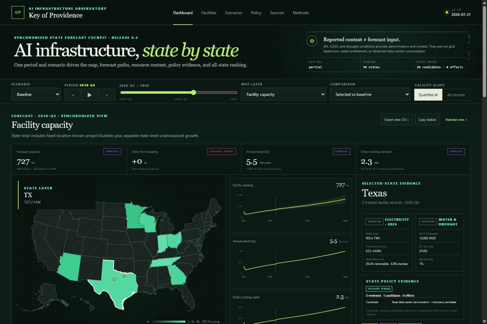

# Key of Providence

**A source-linked observatory for United States AI data-center capacity, resource demand, constraints, and conditional futures.**

Key of Providence turns public evidence into an inspectable research interface. It keeps facility power, IT power, annual electricity, compute equivalents, water, project status, and forecast expectations separate—and makes every analytical value disclose what it is.

> [!IMPORTANT]
> Release `0.2.0` is a research pilot, not a national census or calibrated production forecast. Facility power and compute values are estimates adapted from [Epoch AI's AI Data Centers dataset](https://epoch.ai/data/data-centers-documentation), not utility meter readings. Forecast intervals are transparent sensitivity envelopes, not validated coverage claims.

## Product preview



[Rapid-AI scenario comparison](docs/media/02-rapid-ai-scenario.png) · [Facility evidence and provenance](docs/media/03-facility-provenance.png) · [Scenario engine](docs/media/04-scenario-engine.png)

## What is implemented

- Offline-capable 50-state choropleth with Alaska/Hawaii insets, state/facility drill-down, and explicit missing-evidence hatching
- Shared scenario, period, layer, comparison, and state selection across the map, three forecast paths, KPIs, policy evidence, URL, and sortable table
- 900 ms play/pause/previous/next timeline with no autoplay or looping and reduced-motion support
- Reported EIA 2024 electricity, USGS 2015 freshwater-withdrawal, and weekly U.S. Drought Monitor context for every state
- Fixed facility points with forecast known-project bubbles, catalogued-capacity ceiling rings, and state-only unannounced growth
- With/without-policy and two-state comparisons, current-view CSV, research citation, release-change feed, and source-lineage drawer
- Qualified-AI evidence filter that does not infer AI use from cloud ownership alone
- Canonical facility IDs, phase status, AI confidence, analyst-review status, and city-level disclosure points
- Separate raw catalogued, operational-share, and probability-adjusted facility MW
- Explicit IT MW, annual TWh, direct cooling-water, and H100-equivalent semantics
- Apparent grid-supply MVA screening plus an explicit land-evidence coverage gate; no invented transformer counts or acres-per-MW
- Nine curated scenario bundles with visible parameters and no assigned probabilities
- Tested hindcast scoring functions plus an executable calibration gate that currently blocks calibrated-forecast claims
- Quarterly model outputs through 2030 and annual outputs from 2031 through 2040
- Source registry with coverage, cadence, license, access method, and known gaps
- 50-state NCSL incentive discovery index with 38 model-inactive candidates and a mandatory primary-source review gate before model changes
- Machine-readable live data-run ledger that exposes passed, stale, blocked, credential-required, partial, and update-available source states
- Local-only analyst notebook with hash-chained draft receipts and JSON export; receipts cannot alter a release or substitute for authenticated approval
- Source links, calculation-sheet links, release citation copy, and CSV export
- Release-pinned county and HUC-8 crosswalks, regional principal-aquifer context, and a provisional legacy control-area screen
- Public-use 2025 retail-utility territory screening that preserves overlaps and remains excluded from forecasts until primary service evidence confirms it
- Versioned dataset/model release manifest, executable model tests, and CI
- Frozen as-of release selector, cross-artifact SHA-256 release audit, and manually dispatched zero-cost GitHub Pages deployment

## Quick start

Prerequisites: Node.js 24+ and pnpm 11+.

```bash
pnpm install
pnpm dev
```

Open the local URL printed by Vite. To verify a release:

The development server permits Vite's inline style injection only while serving locally. `pnpm build` preserves the stricter production policy in `index.html`.

```bash
pnpm lint
pnpm data:audit:epoch -- --as-of 2026-07-21
pnpm data:discover:policy-index -- --as-of 2026-07-21
pnpm data:build:state-policies
pnpm data:audit:live -- --as-of 2026-07-21
pnpm data:derive:epoch -- --as-of 2026-07-21
pnpm model:calibration-readiness -- --as-of 2026-07-21 --check
pnpm release:audit -- --as-of 2026-07-21
pnpm test
pnpm build
```

To freeze a new upstream Epoch release without overwriting history:

```bash
pnpm data:refresh:epoch -- --as-of YYYY-MM-DD
```

The command validates required columns, records the upstream row count and access time, computes a SHA-256 checksum, and refuses to overwrite an existing dated snapshot unless `--force` is deliberately supplied.

County assignments are generated separately so geocoder drift cannot silently rewrite a release:

```bash
pnpm data:crosswalk:counties -- --as-of YYYY-MM-DD
```

The crosswalk pins the Census benchmark/vintage, discards returned exact coordinates, and labels city-centroid fallbacks `Imputed` with low confidence.

The HUC-8 crosswalk uses the same disclosure policy against the release-pinned USGS WBD service:

```bash
pnpm data:crosswalk:watersheds -- --as-of YYYY-MM-DD
```

Regional principal-aquifer context comes from the public-domain USGS 2003 data release. It is a surface-location intersection only—not evidence of a facility water source, well, withdrawal, right, or use:

```bash
pnpm data:crosswalk:aquifers -- --as-of YYYY-MM-DD
```

The balancing-authority command queries a public-use 2021 HIFLD control-area snapshot. Every result is deliberately low-confidence and excluded from forecast inputs until serving-utility and electrical-topology evidence confirms it:

```bash
pnpm data:crosswalk:balancing-authorities -- --as-of YYYY-MM-DD
```

The 2025 HIFLD retail-territory snapshot is handled the same way. Eleven of 18 curated records intersect multiple candidates, so the release retains every overlap and does not guess the provider:

```bash
pnpm data:crosswalk:utility-territories -- --as-of YYYY-MM-DD
```

State-resource refreshes use `EIA_API_KEY` only in the release-generation environment. OpenStates discovery uses `OPENSTATES_API_KEY`; neither key is bundled into the browser. Review-only snapshots are generated with:

```bash
pnpm data:refresh:state-context -- --review-snapshot
pnpm data:discover:state-policies
```

The public NCSL incentive index can be refreshed without a secret, but it remains secondary discovery evidence:

```bash
pnpm data:discover:policy-index -- --as-of YYYY-MM-DD
pnpm data:build:state-policies
pnpm data:audit:live -- --as-of YYYY-MM-DD
```

The July 21 data run is intentionally `partial`: the U.S. Drought Monitor returned 50 live state responses and the NCSL index returned all 50 states, while the EIA demo endpoint was rate-limited, `OPENSTATES_API_KEY` was unavailable, no state instrument had completed primary legal review, and the remote Epoch package had changed after the frozen cutoff. The dashboard preserves the last valid immutable release and displays every one of those conditions.

The weekday policy and Thursday resource workflows create immutable inbox snapshots and review pull requests. They never update the public release or forecast automatically; an upstream failure leaves the last valid public JSON untouched.

## Research semantics

Every measurement is assigned one of seven provenance classes:

| Class | Meaning |
| --- | --- |
| Observed | Directly measured by a credible source |
| Reported | Attributable statement, filing, permit, or disclosure |
| Verified derived | Transparent equation applied to documented inputs |
| Estimated | Model-based inference with method and uncertainty |
| Imputed | Missing value filled with an explicit rule |
| Forecast | Future output from the baseline model |
| Scenario output | Future output conditional on an alternative bundle |

No transform may silently change a value's class. The quantitative contract retains unit, definition, geography, time, source, publication date, access date, license, method, uncertainty, dataset version, and update time.

### Headline measures

- **Facility MW** includes IT equipment and facility overhead.
- **IT MW** is derived as `facility MW ÷ PUE`.
- **Operational MW** counts only the operating share of a project phase.
- **Probability-adjusted MW** is `Σ(phase facility MW × completion probability)`.
- **Annual TWh** is `facility MW × load factor × 8,760 ÷ 1,000,000`.
- **H100 equivalent** uses theoretical 8-bit peak operations per second; it is not measured utilization or annual effective compute.

See [the data contract](docs/DATA_CONTRACT.md) for definitions and [the model card](docs/MODEL_CARD.md) for intended use, structure, uncertainty, and calibration requirements.
See [the security model](docs/SECURITY_MODEL.md) for location disclosure, untrusted-document handling, analyst roles, and incident response.
See [coverage gaps and non-inference rules](docs/COVERAGE_GAPS.md) for the evidence required before provisional utility, BA, ISO/RTO, water, land, or equipment relationships can become analytical facts.

## Architecture

Release 0.2 is intentionally static-first so it can run locally or on free static hosting without a paid database, map-tile service, or runtime API:

```text
public sources + analyst review
              │
              ▼
versioned TypeScript catalogue ──► deterministic domain model ──► React interface
              │                              │                         │
              └─ source and license links    └─ tests + scenarios      └─ CSV export
```

- **UI:** React, TypeScript, Vite
- **Map:** local `us-atlas` TopoJSON rendered with `d3-geo`
- **Model:** deterministic, browser-executed TypeScript functions
- **Data:** checked-in release catalogue plus immutable JSON manifest
- **Verification:** Vitest, TypeScript production build, ESLint, GitHub Actions

This design proves the product semantics at zero capital cost. Release-generation commands use free public services and freeze small derived artifacts; the deployed application makes no third-party runtime calls. A production update pipeline can later add Python ingestion/modeling, Parquet snapshots, PostGIS crosswalks, object storage, signed analyst approvals, and an API without changing the public provenance contract.

## Repository map

```text
src/
  components/             map, synchronized small multiples, state table, provenance UI
  data/                   facilities, state context, policy coverage, scenarios, crosswalks
  domain/                 types, equations, aggregation, forecasting, tests
docs/
  DATA_CONTRACT.md        entity and quantitative-field contract
  MODEL_CARD.md           intended use, model limits, calibration gate
data/raw/epoch-ai/        immutable upstream CSV, checksum manifest, attribution
public/data/
  release-manifest.json   hashes, source versions, schemas, freshness thresholds
  releases/.../data-run.json  machine-readable live audit, blockers, and gaps
.github/workflows/        CI, manual Pages deploy, review-only research refreshes
```

## Data credit and release boundary

The curated facility pilot adapts a subset of **Epoch AI, “AI Data Centers,”** accessed July 21, 2026 and published under CC BY. Each facility links to upstream evidence and a calculation sheet where available. U.S. government research and proceedings from LBNL, EIA, USGS, and FERC are registered as contextual or future adapter sources.

> [!NOTE]
> “No record” means no record in this release. It must never be interpreted as zero infrastructure. Exact facility coordinates are not displayed; the public map uses city-level points.

## Next research gates

1. Confirm facility-serving utilities and current BA/ISO/RTO relationships from utility, interconnection, and electrical-topology evidence; the included HIFLD screen is not forecast-eligible.
2. Add building/phase, permit, utility-service, interconnection, aquifer-supply, and water-utility relationships without converting spatial proximity into service claims.
3. Freeze multiple truly historical source releases and replace demonstration completion weights with hindcast-calibrated transition or survival estimates.
4. Separate known-project completion from a statistically validated unannounced-site placement model.
5. Add correlated uncertainty and calibrated binding-constraint probabilities while retaining national/state reconciliation.
6. Add authenticated signed approvals, append-only audit logs, failure states, and historical “as of” replay.

Production launch requires passing those calibration, licensing, geographic, accessibility, security, and reproducibility gates; a successful frontend build alone is not sufficient.

## Preview deployment

The repository includes a manually dispatched GitHub Pages workflow. It reruns the frozen-data audit, derivation, lint, tests, and production build before uploading `dist`. It does not deploy on push; a repository maintainer must deliberately enable Pages and run **Deploy research release to GitHub Pages**.
